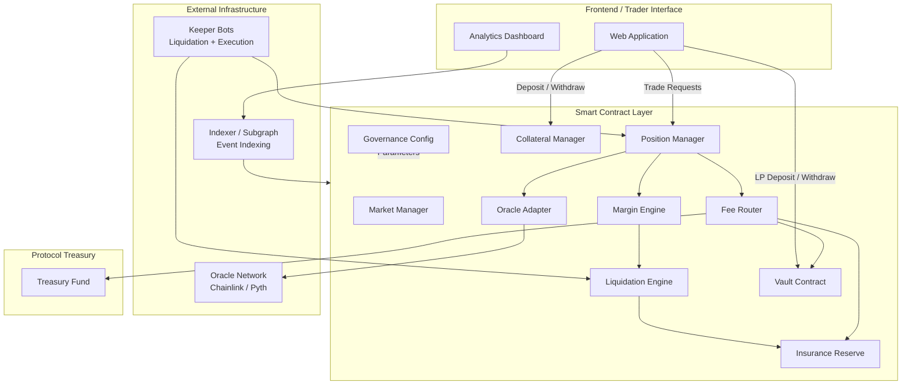
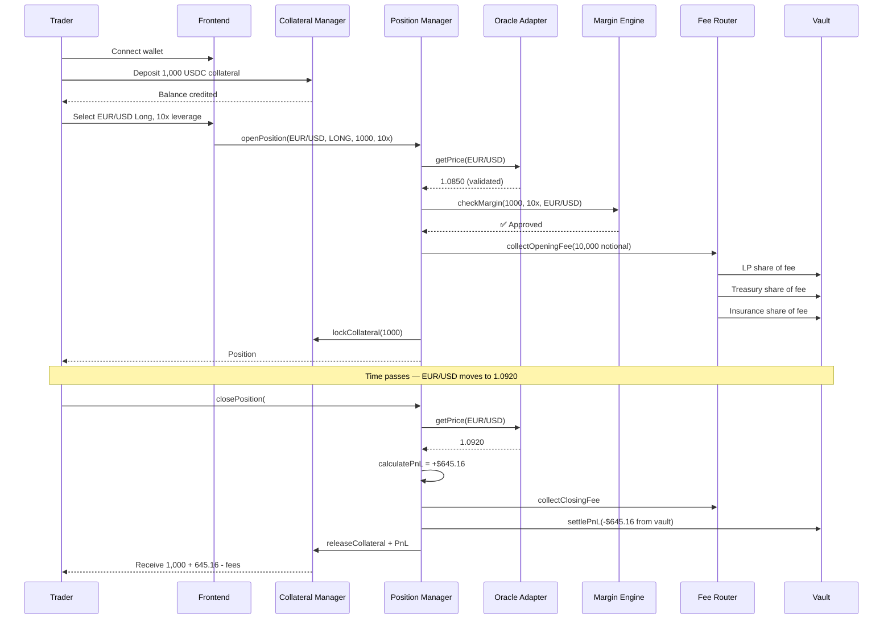
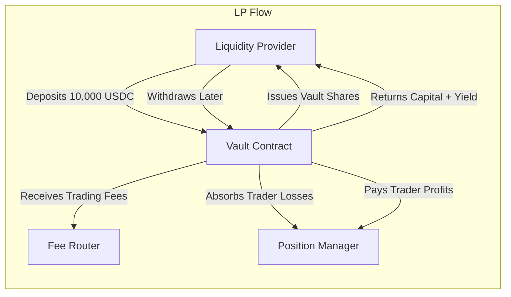
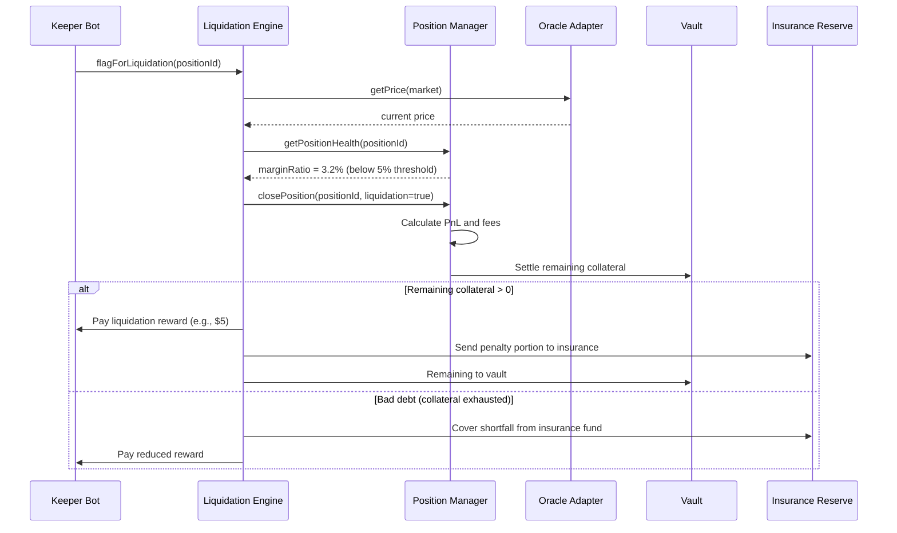
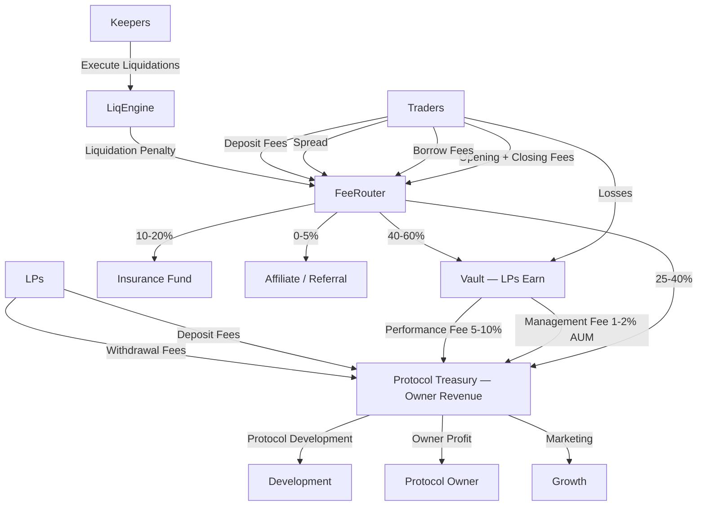

# Decentralized Synthetic Forex Broker

## On-Chain Forex Trading Protocol with Vault-Based Liquidity

[](#)
[](#)
[](#)
[](#)

> **A permissionless, oracle-driven synthetic forex trading protocol where traders gain leveraged exposure to global currency pairs, liquidity providers earn yield by underwriting markets, and the protocol captures revenue at every layer of the stack.**

---

## Table of Contents

- [Executive Summary](#executive-summary)
- [Who This Is For](#who-this-is-for)
- [Why Now](#why-now)
- [Vision](#vision)
- [The Problem with Traditional Forex Brokers](#the-problem-with-traditional-forex-brokers)
- [Why a Decentralized Synthetic Forex Broker Makes Sense](#why-a-decentralized-synthetic-forex-broker-makes-sense)
- [High-Level Architecture Overview](#high-level-architecture-overview)
- [Core System Components](#core-system-components)
- [Core Smart Contract Modules](#core-smart-contract-modules)
- [How Trading Works — Step by Step](#how-trading-works--step-by-step)
- [How Liquidity Providers and Vaults Work](#how-liquidity-providers-and-vaults-work)
- [How Synthetic Assets and Synthetic Pairs Work](#how-synthetic-assets-and-synthetic-pairs-work)
- [Oracle Design and Price Feeds](#oracle-design-and-price-feeds)
- [Margin Engine and Position Accounting](#margin-engine-and-position-accounting)
- [Liquidation Engine](#liquidation-engine)
- [Vault Accounting and LP Share Model](#vault-accounting-and-lp-share-model)
- [Protocol Revenue Model — All Profit Sources](#protocol-revenue-model--all-profit-sources)
- [Insurance and Backstop Layer](#insurance-and-backstop-layer)
- [Risk Management Framework](#risk-management-framework)
- [Example Trade Lifecycle](#example-trade-lifecycle)
- [Example LP Lifecycle](#example-lp-lifecycle)
- [Revenue and Incentive Flows](#revenue-and-incentive-flows)
- [Why This Model Works Even with Modest Starting Liquidity](#why-this-model-works-even-with-modest-starting-liquidity)
- [Key Technical Challenges](#key-technical-challenges)
- [Security Considerations](#security-considerations)
- [Scalability and Future Expansion](#scalability-and-future-expansion)
- [Possible Version 1 — Beta Scope](#possible-version-1--beta-scope)
- [Suggested V1 Contract List](#suggested-v1-contract-list)
- [Suggested Tech Stack](#suggested-tech-stack)
- [Potential Monetization Summary](#potential-monetization-summary)
- [Why This Could Become a Powerful On-Chain Broker Alternative](#why-this-could-become-a-powerful-on-chain-broker-alternative)
- [Build Capability, Cost, and Timeline](#build-capability-cost-and-timeline)
- [Contact](#contact)

---

## Executive Summary

This document describes the architecture of a **decentralized, on-chain synthetic forex trading protocol** — a system that allows anyone in the world to trade leveraged exposure to global currency pairs (EUR/USD, GBP/USD, USD/JPY, and more) without relying on a centralized broker, custodial account, or traditional banking infrastructure.

The protocol operates through a set of smart contracts deployed on a public blockchain. At its core:

- **Traders** deposit stablecoin collateral and open long or short positions on synthetic forex pairs. Positions are priced using decentralized oracle feeds, and all profit/loss (PnL) is settled on-chain in real time.
- **Liquidity Providers (LPs)** deposit capital into a shared vault that acts as the economic counterparty to all trades. LPs earn from trading fees and net trader losses, while bearing the risk of net trader profits.
- **The Protocol** captures fees at multiple points — trade entry, trade exit, borrowing, liquidations, funding imbalances, and vault management — generating a continuous, diversified revenue stream for the protocol treasury and its stakeholders.
- **Synthetic pricing** eliminates the need for actual fiat settlement or deep spot liquidity for each currency pair. The system provides *exposure* to forex price movements, not physical delivery of currencies.

Economically, this protocol functions like a decentralized broker-dealer: it intermediates between traders and a liquidity pool, earns revenue from market activity, and manages risk through automated on-chain controls. Architecturally, it is fully decentralized — no dealing desk, no hidden spread manipulation, no custodial counterparty risk. Every position, every fee, and every liquidation is verifiable on the blockchain.

> **In short: this is a protocol that turns a smart contract vault into a forex broker — transparent, permissionless, and revenue-generating from day one.**

---

## Who This Is For

| Audience | What You'll Get from This Document |
|---|---|
| **Founders & Entrepreneurs** | A clear understanding of a commercially viable DeFi protocol design with multiple revenue streams |
| **Investors & Analysts** | A technically grounded business model with transparent economics and identifiable moats |
| **Developers & Engineers** | A modular architecture blueprint detailed enough to begin implementation |
| **DeFi Enthusiasts** | An educational walkthrough of how synthetic forex markets can operate on-chain |
| **Traditional Forex / CFD Operators** | A decentralized alternative to the dealing desk model with lower infrastructure overhead |

---

## Why Now

The convergence of several industry dynamics makes this the right moment for on-chain synthetic forex:

1. **Oracle infrastructure has matured.** Chainlink, Pyth, RedStone, and others now provide sub-second, high-fidelity price feeds for major forex pairs — the critical dependency for synthetic trading.
2. **Perpetual/synthetic trading models are proven.** Protocols like GMX, GNS (gTrade), Synthetix Perps, and Kwenta have demonstrated that vault-backed synthetic trading works at scale, collectively processing billions in volume.
3. **Forex is the world's largest market.** Over $7.5 trillion trades daily in traditional forex — yet on-chain forex exposure remains a tiny fraction of DeFi activity, representing a massive greenfield opportunity.
4. **Regulatory pressure on centralized brokers is increasing.** Traders in many jurisdictions face account freezes, withdrawal delays, and opaque execution. A non-custodial, transparent alternative has genuine demand.
5. **L2 and alt-L1 costs have dropped dramatically.** Gas fees on Arbitrum, Base, Optimism, and Solana make frequent trading — including leveraged positions — economically viable for retail users.
6. **Stablecoin adoption is at an all-time high.** USDC and USDT circulating supply exceeds $150B, providing the collateral base for a synthetic forex venue.

---

## Vision

To build the **most accessible, transparent, and capital-efficient forex trading venue in DeFi** — one that:

- Gives any person with a wallet access to global currency markets
- Rewards liquidity providers with real, fee-derived yield
- Generates protocol revenue comparable to traditional brokerage models
- Operates without a centralized intermediary, custodial risk, or geographic restriction
- Scales from a modest initial deployment to a multi-market, multi-asset synthetic exchange

---

## The Problem with Traditional Forex Brokers

Traditional retail forex brokers share a set of structural problems that have persisted for decades:

### Counterparty Opacity
Most retail forex brokers operate as the direct counterparty to their clients (B-book model). When a trader loses, the broker profits — and this profit motive creates perverse incentives around execution quality, spread widening, and stop hunting. Traders have no way to verify whether their orders received fair execution.

### Custodial Risk
Traders must deposit funds into the broker's bank account. The broker controls those funds. Platform insolvencies, regulatory seizures, or fraud can result in permanent loss. The history of retail forex is littered with broker collapses.

### Geographic and Regulatory Barriers
Brokers must hold licenses in each jurisdiction, and traders in restricted regions often cannot access the most competitive platforms. KYC/AML onboarding can take days.

### Hidden Fee Structures
Spreads are often marked up silently. Requotes, slippage, and asymmetric execution are common in volatile markets. Traders rarely know the *true* cost of their trades.

### No Yield Opportunity for the Other Side
In a traditional broker, the house (the dealing desk) captures net trader losses. There is no mechanism for outside participants to earn by providing that liquidity. The economics are zero-sum between trader and broker, with no shared upside.

### Settlement Dependency on Banking Rails
Each currency pair requires actual positions in interbank markets or nostro/vostro accounts. This imposes massive infrastructure costs and limits which pairs can be offered.

---

## Why a Decentralized Synthetic Forex Broker Makes Sense

A well-designed on-chain synthetic forex protocol solves each of the above problems:

| Traditional Broker Problem | Decentralized Protocol Solution |
|---|---|
| Opaque counterparty | Vault is on-chain; all positions, PnL, and fees are verifiable |
| Custodial risk | Non-custodial; traders retain control of collateral until settlement |
| Geographic restrictions | Permissionless access with a wallet and internet connection |
| Hidden fees | Fee parameters are published in smart contract code and governance |
| No LP yield opportunity | Anyone can deposit into the vault and earn from trading activity |
| Banking rail dependency | Synthetic pricing via oracles — no fiat custody needed |
| Limited market hours | On-chain markets can operate 24/7/365 (oracle permitting) |

### Why This Matters
> The protocol doesn't just replicate a broker — it *improves* on the model by making the counterparty transparent, the fees explicit, the access permissionless, and the yield opportunity democratized.

---

## High-Level Architecture Overview



The architecture is **modular by design**. Each contract has a single responsibility, communicates through well-defined interfaces, and can be upgraded or replaced independently. This modularity reduces audit surface area, simplifies testing, and allows the protocol to evolve without full redeployment.

---

## Core System Components

### 1. Trader Interface / Frontend
A web application (and potentially a mobile-responsive PWA) that allows traders to:
- Connect a wallet (MetaMask, WalletConnect, etc.)
- Deposit and withdraw collateral
- Browse available forex markets with live pricing
- Open, manage, and close long/short positions
- View position PnL in real time
- Monitor margin health and liquidation thresholds
- Review trade history and fee breakdowns

### 2. Smart Contract Markets
Each tradable forex pair (e.g., EUR/USD) is represented as a **market** within the protocol. Markets define:
- The oracle price feed used for that pair
- Maximum leverage allowed
- Open interest caps (long and short)
- Fee parameters (opening, closing, borrowing)
- Funding rate mechanics for that pair
- Minimum and maximum position sizes

### 3. Vault Contract(s)
The vault is the **liquidity backbone** of the protocol. It:
- Accepts stablecoin deposits from LPs
- Issues proportional vault shares
- Acts as the economic counterparty to all open positions
- Receives fee income
- Absorbs net trader PnL (positive or negative)
- Manages withdrawal queuing to prevent bank-run dynamics

### 4. Oracle Module
An adapter layer that normalizes price feeds from one or more oracle providers. It handles:
- Price retrieval and caching
- Staleness checks
- Deviation thresholds
- Fallback logic when a primary oracle fails
- Circuit breakers when price movement exceeds safe bounds

### 5. Margin / Risk Engine
The risk engine is consulted on every position open, modify, and close. It enforces:
- Initial margin requirements
- Maintenance margin thresholds
- Maximum leverage per market
- Open interest limits (absolute and relative to vault)
- Position size limits (min/max)
- Portfolio-level margin calculations (future)

### 6. Liquidation Engine
Continuously monitored by off-chain keeper bots. When a trader's margin ratio falls below the maintenance threshold:
- The position is forcibly closed at the oracle price
- A liquidation penalty is charged
- The penalty is split between the liquidator (incentive), the vault, and the insurance fund
- If the position is underwater (bad debt), the insurance fund covers the shortfall

### 7. Fee Router
A contract that receives all protocol fees and distributes them according to configurable ratios:
- Vault (LP reward)
- Treasury (protocol revenue)
- Insurance fund (backstop reserve)
- Referrer (if applicable)

### 8. Treasury
The protocol treasury accumulates revenue from its share of all fee streams. These funds can be used for:
- Protocol development
- Buybacks or token incentives (if tokenized)
- Operational costs
- Ecosystem grants

### 9. Insurance Fund
A reserve pool designed to absorb bad debt from liquidations that fail to fully cover losses. Funded by:
- A portion of all trading fees
- Liquidation penalties
- Direct protocol contributions

### 10. Governance / Parameter Manager
A configuration contract (or multisig-controlled admin) that manages:
- Fee rates per market
- Leverage limits
- Open interest caps
- Oracle configuration
- Vault parameters (withdrawal cooldowns, max utilization)
- Insurance fund thresholds
- Emergency pause triggers

### 11. Indexer / Analytics Layer
An off-chain indexing service (The Graph, custom indexer, or database) that:
- Processes on-chain events (trades, liquidations, deposits, withdrawals)
- Powers the analytics dashboard
- Provides historical data for charting and PnL tracking
- Enables leaderboards, portfolio tracking, and reporting

### 12. Keeper / Relayer Infrastructure
Off-chain bots responsible for:
- Executing liquidations when margin thresholds are breached
- Processing delayed orders (limit orders, stop losses)
- Triggering funding rate updates
- Monitoring oracle health and triggering circuit breakers

---

## Core Smart Contract Modules

### Vault Contract

| Attribute | Detail |
|---|---|
| **Purpose** | Hold LP deposits, issue/redeem vault shares, absorb trader PnL, receive fee income |
| **Key Inputs** | LP deposits (stablecoin), fee distributions, PnL settlements |
| **Key Outputs** | Vault share tokens, withdrawal payouts, utilization metrics |
| **Key State** | `totalAssets`, `totalShares`, `pendingWithdrawals`, `utilizationRatio`, `maxCapacity` |
| **Why It Matters** | The vault IS the house. It is the economic engine of the protocol. Its health determines whether traders can be paid, LPs are earning, and the protocol is solvent. |

### Position Manager

| Attribute | Detail |
|---|---|
| **Purpose** | Open, modify, and close trader positions; track all active positions |
| **Key Inputs** | Trade direction, size, collateral, market ID, oracle price |
| **Key Outputs** | Position records, PnL calculations, settlement instructions |
| **Key State** | `positions[]`, `openInterestLong`, `openInterestShort`, `positionCount` |
| **Why It Matters** | This is the core trading logic. Every trade flows through the position manager, and every PnL settlement originates here. |

### Market Contract

| Attribute | Detail |
|---|---|
| **Purpose** | Define parameters for each tradable market (forex pair) |
| **Key Inputs** | Governance configuration updates |
| **Key Outputs** | Market parameters consumed by position manager and margin engine |
| **Key State** | `maxLeverage`, `maxOpenInterest`, `fundingRate`, `feeRates`, `oracleFeedId`, `isActive` |
| **Why It Matters** | Market isolation allows each pair to have independent risk parameters, preventing contagion between markets. |

### Collateral Manager

| Attribute | Detail |
|---|---|
| **Purpose** | Handle all deposits and withdrawals of trader collateral; escrow collateral for open positions |
| **Key Inputs** | Deposit/withdrawal requests, settlement instructions from position manager |
| **Key Outputs** | Collateral transfers, balance updates |
| **Key State** | `traderBalances[]`, `lockedCollateral[]`, `totalDeposited` |
| **Why It Matters** | Clean separation of collateral custody from trading logic reduces surface area for fund-loss bugs. |

### Oracle Adapter

| Attribute | Detail |
|---|---|
| **Purpose** | Normalize and validate price feeds from external oracles |
| **Key Inputs** | Raw oracle data (Chainlink, Pyth, etc.) |
| **Key Outputs** | Validated price, timestamp, confidence interval |
| **Key State** | `lastPrice`, `lastTimestamp`, `deviationThreshold`, `maxStaleness`, `fallbackOracle` |
| **Why It Matters** | Every position open, close, and liquidation depends on the oracle price. A compromised or stale oracle can drain the vault. This module is the single most security-critical component. |

### Liquidation Contract

| Attribute | Detail |
|---|---|
| **Purpose** | Identify and execute liquidations for undercollateralized positions |
| **Key Inputs** | Position data, current oracle price, maintenance margin threshold |
| **Key Outputs** | Liquidation execution, penalty distribution, bad debt flagging |
| **Key State** | `liquidationThreshold`, `liquidationPenaltyBps`, `liquidatorRewardBps` |
| **Why It Matters** | Liquidations are the protocol's immune system. Without reliable liquidations, bad debt accumulates and the vault becomes insolvent. |

### Insurance Reserve

| Attribute | Detail |
|---|---|
| **Purpose** | Absorb bad debt that liquidations fail to cover; provide a backstop for vault solvency |
| **Key Inputs** | Fee allocations, penalty income, direct deposits |
| **Key Outputs** | Bad debt coverage payouts |
| **Key State** | `reserveBalance`, `totalBadDebtCovered`, `targetReserveRatio` |
| **Why It Matters** | In extreme volatility, liquidations may not fully cover losses. The insurance fund prevents these edge cases from becoming systemic failures. |

### Fee Distribution Contract

| Attribute | Detail |
|---|---|
| **Purpose** | Collect all fees and distribute them to vault, treasury, insurance, and referrers |
| **Key Inputs** | Fee payments from position manager and liquidation contract |
| **Key Outputs** | Split payments to vault, treasury, insurance fund, referrers |
| **Key State** | `feeRatios`, `totalFeesCollected`, `distributionHistory` |
| **Why It Matters** | This is the revenue engine of the protocol. Every dollar of revenue flows through this contract. |

### Governance Config Contract

| Attribute | Detail |
|---|---|
| **Purpose** | Store and manage all configurable protocol parameters |
| **Key Inputs** | Governance/admin transactions |
| **Key Outputs** | Parameter values consumed by all other contracts |
| **Key State** | All protocol parameters (fee rates, leverage limits, OI caps, oracle configs, etc.) |
| **Why It Matters** | Centralized parameter management simplifies administration and provides a clear audit trail for every configuration change. |

---

## How Trading Works — Step by Step



### Step-by-Step Breakdown

1. **Deposit Collateral** — The trader sends stablecoins (e.g., USDC) to the Collateral Manager. These funds are held in escrow.

2. **Select Market and Direction** — The trader chooses a forex pair (EUR/USD) and a direction (long = EUR strengthens vs USD; short = EUR weakens vs USD).

3. **Set Size and Leverage** — With $1,000 collateral and 10x leverage, the trader controls $10,000 of notional exposure.

4. **Oracle Price Fetch** — The Position Manager queries the Oracle Adapter for the current validated price of EUR/USD.

5. **Margin Validation** — The Margin Engine confirms the trader meets initial margin requirements for this market and leverage level.

6. **Fee Collection** — An opening fee (e.g., 0.08% of notional = $8.00) is deducted and routed to the vault, treasury, and insurance fund.

7. **Collateral Lock** — The trader's deposited collateral is locked against the position. It cannot be withdrawn while the position is open.

8. **Position Opens** — The position is recorded on-chain: entry price, direction, size, leverage, collateral, timestamp.

9. **Position Remains Open** — As the oracle price changes, the trader's unrealized PnL updates. Borrow/funding fees accrue over time.

10. **Position Closes** — The trader (or liquidation bot) closes the position. Final PnL is calculated, fees are collected, and the net result is settled against the vault.

> **Key insight:** The vault is the counterparty. If the trader profits $645, the vault pays $645. If the trader loses $645, the vault receives $645. The protocol earns fees regardless of who wins.

---

## How Liquidity Providers and Vaults Work



### LP Experience — End to End

1. **Deposit** — An LP deposits stablecoins into the vault. The vault calculates the current **share price** (total vault assets ÷ total shares outstanding) and issues proportional shares.

2. **Earning** — While funds are in the vault, the LP earns from:
   - **Trading fees** routed to the vault (opening, closing, borrow, liquidation)
   - **Net trader losses** — when traders lose money, that capital flows into the vault
   - **Funding fee income** — when long/short imbalances generate funding payments

3. **Risk Bearing** — LPs are not earning risk-free yield. The vault also:
   - **Pays out trader profits** — when traders win, the vault's assets decrease
   - **May experience drawdowns** during periods of high trader profitability or extreme volatility

4. **Withdrawal** — The LP redeems vault shares for the underlying stablecoins at the current share price. If the vault has earned net fees and trader losses exceed trader wins, the share price will be higher than at deposit — the LP profits. If traders have been net profitable, the share price may be lower.

### Vault Share Value Mechanics

```
Share Price = Total Vault Assets / Total Vault Shares

Total Vault Assets = Deposits + Fee Income + Net Trader Losses - Net Trader Profits - Insurance Contributions
```

### Honest LP Risk Disclosure

LPs should understand:

- **This is not a savings account.** LP returns depend on trading volume, fee generation, and the net profitability of traders.
- **Statistically, traders tend to lose.** Across traditional forex, roughly 70–80% of retail traders are net losers. This structural tendency benefits LPs over time.
- **However, streak risk exists.** A skilled trader or a one-directional market move can cause short-term vault losses.
- **Risk controls are essential.** Open interest caps, leverage limits, and diversification across many traders reduce the probability of catastrophic drawdowns.

> **Why this matters:** The honest articulation of LP risk is a feature, not a bug. Traditional brokers hide this dynamic. This protocol makes it transparent and lets participants opt in knowingly.

---

## How Synthetic Assets and Synthetic Pairs Work

### What "Synthetic" Means in This Context

The protocol does **not** hold actual euros, pounds, or yen. It does not move fiat through bank accounts. Instead:

- The protocol uses **oracle price feeds** to track the live exchange rate of forex pairs (e.g., EUR/USD = 1.0850).
- Traders open positions that give them **economic exposure** to the price movement of that pair.
- All settlement is in **stablecoin terms** (e.g., USDC). If EUR/USD goes up by 1% and you're long with $10,000 notional, you gain $100 USDC. No euros are involved.

This is functionally identical to how **Contracts for Difference (CFDs)** work in traditional finance — you gain exposure to price movements without owning the underlying asset.

### Position-Based vs. Token-Based Synthetics

There are two approaches to synthetic asset design:

| Approach | Description | Complexity | Recommended for V1? |
|---|---|---|---|
| **Position-based** | Exposure exists only as an open position in the protocol. No transferable token. | Lower | ✅ Yes |
| **Token-based** | Minting a transferable ERC-20 synthetic token (e.g., sEUR) | Higher — requires global debt pool, minting/burning, DEX integration | ❌ Not for V1 |

**Recommendation:** Version 1 should use **position-based synthetic exposure only**. This dramatically simplifies the architecture, avoids the complexities of global debt pools, and is sufficient for a trading-focused protocol. Token-based synthetics can be explored in future versions if there is demand for transferable synthetic forex tokens.

### Why Synthetic Forex Is Powerful

- **No fiat custody** — The protocol never touches real currencies
- **Instant pair listing** — Any pair with a reliable oracle feed can be added in minutes
- **24/7 trading** — No dependency on banking hours or settlement windows
- **Global access** — Anyone with a wallet can trade any pair
- **Capital efficiency** — No need to source bilateral liquidity for each pair; the vault underwrites all markets

---

## Oracle Design and Price Feeds

Oracle quality is the **single most important security consideration** in a synthetic trading protocol. An incorrect price — even for a few seconds — can cause wrongful liquidations, mispriced entries, or vault drainage.

### Requirements

| Requirement | Description |
|---|---|
| **Accuracy** | Prices must reflect real global forex rates with minimal deviation |
| **Freshness** | Prices must update frequently; stale data is unacceptable for trading |
| **Tamper resistance** | No single entity should be able to manipulate the price feed |
| **Availability** | Feeds must have high uptime; downtime halts trading |
| **Fallback** | If the primary oracle fails, a secondary must be available |

### Recommended Oracle Configuration

```
Primary:      Pyth Network (sub-second updates, pull-based)
Secondary:    Chainlink (time-tested, push-based)
Tertiary:     RedStone or API3 (additional redundancy)

Staleness threshold:    30 seconds for primary, 120 seconds for fallback
Deviation threshold:    0.5% max deviation between primary and secondary
Circuit breaker:        Pause market if price moves > 5% in 60 seconds
```

### Oracle Safety Mechanisms

1. **Staleness Guard** — Reject any price older than the configured threshold. If no fresh price is available, the market pauses.
2. **Cross-Oracle Deviation Check** — Compare prices from two or more oracles. If they diverge beyond the threshold, halt execution until they converge.
3. **Circuit Breaker** — If the price moves by more than a configured percentage in a short window, freeze the market. This protects against flash crashes, oracle manipulation, and fat-finger errors.
4. **Delayed Execution** — For larger orders, introduce a brief delay (e.g., 2-5 seconds) between order submission and execution at oracle price. This mitigates frontrunning and oracle latency exploitation.
5. **Minimum Spread Enforcement** — Apply a small synthetic spread around the oracle price for entries and exits. This protects the vault from adverse selection and creates a buffer for price inaccuracy.

> **Why this matters:** Protocols that have suffered exploits (Mango Markets, BonqDAO) were often undone by oracle manipulation. A defensive oracle design is non-negotiable.

---

## Margin Engine and Position Accounting

### Margin Types

| Margin Type | Description | Typical Value |
|---|---|---|
| **Initial Margin** | Minimum collateral required to open a position | 1/leverage (e.g., 10% for 10x) |
| **Maintenance Margin** | Minimum collateral required to keep a position open | ~50% of initial margin |
| **Liquidation Margin** | Threshold at which liquidation is triggered | At or just below maintenance margin |

### Example

| Parameter | Value |
|---|---|
| Trader collateral | $1,000 |
| Leverage | 10x |
| Notional | $10,000 |
| Initial margin | $1,000 (10%) |
| Maintenance margin | $500 (5%) |
| Liquidation trigger | Unrealized loss ≥ $500 |

### Maximum Leverage Controls

- **Per-market max leverage** — More volatile pairs (e.g., exotic forex) get lower max leverage
- **Global max leverage** — Protocol-wide ceiling (e.g., 50x or 100x)
- **Dynamic leverage** — Higher OI → lower max leverage available (adaptive)

### Open Interest Caps

Each market has maximum open interest limits for both long and short sides. These caps prevent the vault from taking on excessive directional exposure.

```
EUR/USD Max OI Long:   $5,000,000
EUR/USD Max OI Short:  $5,000,000
GBP/USD Max OI Long:   $3,000,000
GBP/USD Max OI Short:  $3,000,000
```

These limits scale with vault size and can be adjusted by governance as the protocol grows.

### Borrow / Funding Mechanics

Positions consume vault capital while they are open. To compensate the vault:

- **Borrow Fee** — A per-hour fee charged on the notional size of open positions (e.g., 0.005%/hr). This is a continuous cost to traders and continuous income to the vault.
- **Funding Rate** — When there is a long/short imbalance, the heavier side pays the lighter side. This incentivizes balanced open interest and reduces vault directional risk.

### Why Isolated Markets Matter

In the initial version, each market should operate with **isolated risk parameters.** A volatility spike in USD/JPY should not affect the risk parameters of EUR/USD. Isolation:

- Prevents cross-market contagion
- Simplifies risk modeling
- Makes each market independently auditable
- Allows gradual scaling (add new markets without increasing systemic risk)

---

## Liquidation Engine

### When Liquidation Occurs

A position is eligible for liquidation when:

```
Remaining Margin = Collateral + Unrealized PnL - Accrued Fees
Margin Ratio = Remaining Margin / Position Notional

IF Margin Ratio < Maintenance Margin Threshold → LIQUIDATE
```

### How Liquidation Works



### Liquidation Distribution

When a position is liquidated with positive remaining collateral:

| Recipient | Share | Purpose |
|---|---|---|
| **Keeper (liquidator)** | Fixed reward or % of penalty | Incentivize fast liquidation execution |
| **Vault** | Majority of remaining collateral | Compensate LPs for risk |
| **Insurance Fund** | Portion of liquidation penalty | Build the backstop reserve |
| **Protocol Treasury** | Small share of penalty | Protocol revenue |

### Bad Debt Handling

If a position is liquidated but the collateral is insufficient to cover the loss:

1. The **insurance fund** covers the shortfall
2. If the insurance fund is depleted, the **vault absorbs** the remaining bad debt (socialized loss)
3. In extreme scenarios, a **governance emergency action** can pause trading or inject capital

### Minimizing Bad Debt

- Conservative maintenance margin thresholds
- Liquidation incentives that encourage speed
- Multiple keeper bot operators for redundancy
- Per-market OI caps to limit maximum possible loss
- Circuit breakers to pause markets during extreme volatility

---

## Vault Accounting and LP Share Model

### Share-Based Accounting

The vault uses an **ERC-4626-style tokenized vault** (or equivalent custom implementation):

```
On Deposit:
  shares_minted = deposit_amount * total_shares / total_assets

On Withdrawal:
  amount_returned = shares_redeemed * total_assets / total_shares

Share Price:
  share_price = total_assets / total_shares
```

### What Changes Vault Assets

| Event | Effect on `total_assets` |
|---|---|
| LP deposit | ➕ Increases |
| LP withdrawal | ➖ Decreases |
| Fee income (opening, closing, borrow, funding, liquidation) | ➕ Increases |
| Trader loss settled | ➕ Increases |
| Trader profit paid out | ➖ Decreases |
| Insurance fund contribution | ➖ Decreases (small) |
| Bad debt absorption | ➖ Decreases (rare, capped) |

### Withdrawal Safeguards

To prevent bank-run dynamics and ensure vault stability:

- **Utilization Cap** — LPs cannot withdraw if doing so would push utilization above a threshold (e.g., 90%). This ensures enough capital remains to cover open positions.
- **Cooldown Period** — Withdrawal requests require a waiting period (e.g., 24–72 hours) before execution. This prevents LPs from frontrunning large trader profits.
- **Epoch-Based Withdrawals** — Withdrawals are processed in daily or weekly epochs rather than instantly, smoothing capital flows.

---

## Protocol Revenue Model — All Profit Sources

> **This section details every revenue stream available to the protocol owner and treasury.** Revenue is generated at multiple touchpoints across the trading lifecycle, creating a **diversified, recurring income model** that compounds with trading volume.

### Complete Revenue Stream Breakdown

```mermaid
flowchart TB
    subgraph Revenue Sources
        OF[Opening Fee\n0.05–0.10% of notional]
        CF[Closing Fee\n0.05–0.10% of notional]
        BF[Borrow Fee\n0.005–0.01% per hour]
        FF[Funding Fee\nImbalance-based]
        LF[Liquidation Penalty\n5–10% of remaining margin]
        SF[Spread / Execution Fee\nBid-ask markup]
        DF[Deposit Fee\n0–0.1% on trader deposits]
        WF[Withdrawal Fee\n0–0.1% on trader withdrawals]
        LPDF[LP Deposit Fee\n0–0.05% on vault deposits]
        LPWF[LP Withdrawal Fee\n0.05–0.3% on vault withdrawals]
        VF[Vault Management Fee\n0–2% annualized on AUM]
        PF[Performance Fee\n0–10% on vault profits]
        NTL[Net Trader Losses\nStatistical edge]
    end

    subgraph Distribution
        VLT[Vault / LPs]
        TRS[Protocol Treasury\n— OWNER REVENUE —]
        INS[Insurance Fund]
        REF[Referrers / Affiliates]
    end

    OF --> TRS
    CF --> TRS
    BF --> TRS
    FF --> TRS
    LF --> TRS
    SF --> TRS
    DF --> TRS
    WF --> TRS
    LPDF --> TRS
    LPWF --> TRS
    VF --> TRS
    PF --> TRS
    NTL --> VLT

    OF --> VLT
    CF --> VLT
    BF --> VLT
    FF --> VLT
    LF --> VLT

    OF --> INS
    LF --> INS
    OF --> REF
```



---

### 💰 Revenue Source #1: Opening Fee (Trade Entry Fee)

| Parameter | Value |
|---|---|
| **Charged when** | Trader opens a position |
| **Basis** | Percentage of notional position size |
| **Typical rate** | 0.05% – 0.10% |
| **Example** | $10,000 notional × 0.08% = **$8.00 fee** |
| **Scales with** | Trading volume — more trades = more revenue |

**Why it's important:** This is the bread-and-butter revenue of any trading protocol. Every single trade that opens generates revenue for the protocol, regardless of whether the trader ultimately wins or loses.

---

### 💰 Revenue Source #2: Closing Fee (Trade Exit Fee)

| Parameter | Value |
|---|---|
| **Charged when** | Trader closes a position (voluntarily or via liquidation) |
| **Basis** | Percentage of notional position size at closing |
| **Typical rate** | 0.05% – 0.10% |
| **Example** | $10,000 notional × 0.08% = **$8.00 fee** |
| **Scales with** | Trading volume |

**Why it's important:** Combined with opening fees, the protocol earns on both entry and exit. A trader who opens and closes a $10,000 position pays roughly $16 in fees. At scale, this is substantial.

---

### 💰 Revenue Source #3: Borrow Fee (Holding Cost)

| Parameter | Value |
|---|---|
| **Charged when** | Continuously, for every hour a position remains open |
| **Basis** | Percentage of notional size per hour |
| **Typical rate** | 0.005% – 0.01% per hour |
| **Example** | $10,000 notional × 0.007%/hr × 24 hrs = **$16.80/day** |
| **Scales with** | Open positions × time held |

**Why it's important:** The borrow fee is *recurring revenue* that accrues as long as positions are open. It compensates the vault and protocol for capital utilization and creates a steady revenue stream independent of trade frequency.

> **Example revenue projection:** If the protocol has $1M in total open interest averaging 0.007%/hr borrow rate, that's **$1,680/day** or **$50,400/month** in borrow fees alone.

---

### 💰 Revenue Source #4: Funding Fee (Imbalance Fee)

| Parameter | Value |
|---|---|
| **Charged when** | When there is long/short open interest imbalance |
| **Basis** | Imbalance ratio × funding rate |
| **Flow** | Heavy side pays → light side + protocol |
| **Protocol take** | A portion of the funding payment flows to treasury |

**Why it's important:** Funding fees incentivize balanced markets while generating protocol revenue from imbalances. In volatile markets where traders pile into one direction, funding fees can be significant.

---

### 💰 Revenue Source #5: Liquidation Penalty

| Parameter | Value |
|---|---|
| **Charged when** | A trader is liquidated |
| **Basis** | Percentage of remaining margin |
| **Typical rate** | 5% – 10% of remaining margin |
| **Split** | Keeper (gas incentive) + Vault + Insurance + Treasury |

**Why it's important:** Liquidations are penalty events that generate above-normal fees. The protocol treasury receives a share of every liquidation penalty.

---

### 💰 Revenue Source #6: Spread / Execution Fee

| Parameter | Value |
|---|---|
| **Charged when** | On every trade execution |
| **Basis** | Small bid-ask spread applied around oracle price |
| **Typical value** | 0.01% – 0.05% per side |
| **Example** | Oracle says 1.0850 → Trader buys at 1.08505, sells at 1.08495 |

**Why it's important:** The spread is invisible to most users but creates a consistent margin on every execution. This is how most traditional brokers make the majority of their revenue.

---

### 💰 Revenue Source #7: Trader Deposit Fee

| Parameter | Value |
|---|---|
| **Charged when** | Trader deposits collateral into the protocol |
| **Typical rate** | 0% – 0.10% |
| **Can be used for** | Revenue and/or to discourage micro-deposits that increase gas costs |

---

### 💰 Revenue Source #8: Trader Withdrawal Fee

| Parameter | Value |
|---|---|
| **Charged when** | Trader withdraws collateral from the protocol |
| **Typical rate** | 0% – 0.10% |
| **Can be used for** | Revenue, withdrawal friction to maintain TVL |

---

### 💰 Revenue Source #9: LP Vault Deposit Fee

| Parameter | Value |
|---|---|
| **Charged when** | LP deposits stablecoins into the vault |
| **Typical rate** | 0% – 0.05% |
| **Rationale** | Prevents deposit/withdraw arbitrage, generates small revenue |

---

### 💰 Revenue Source #10: LP Vault Withdrawal Fee

| Parameter | Value |
|---|---|
| **Charged when** | LP withdraws from the vault |
| **Typical rate** | 0.05% – 0.30% |
| **Rationale** | Discourages rapid LP turnover, protects vault stability, generates revenue |

**Why it's important:** A higher withdrawal fee than deposit fee discourages short-term LP "yield hopping" and creates a net revenue positive on LP flow.

---

### 💰 Revenue Source #11: Vault Management Fee (AUM Fee)

| Parameter | Value |
|---|---|
| **Charged** | Continuously, as an annualized percentage of total vault assets |
| **Typical rate** | 0% – 2% annualized |
| **Example** | $1M vault × 1% annual = **$10,000/year** or **$833/month** |

**Why it's important:** This fee accrues regardless of trading activity. Even during low-volume periods, the protocol earns from the assets under management.

---

### 💰 Revenue Source #12: Performance Fee on Vault Profits

| Parameter | Value |
|---|---|
| **Charged** | On vault profits above a high-water mark |
| **Typical rate** | 5% – 10% of profits |
| **Example** | Vault earns $50,000 in fees/PnL × 10% = **$5,000 to treasury** |

**Why it's important:** Aligns protocol incentives with vault performance. The protocol only takes a performance fee when LPs are making money.

---

### 💰 Revenue Source #13: Net Trader Losses (Statistical Edge)

| Description | Detail |
|---|---|
| **Mechanism** | When traders lose money, that capital flows to the vault |
| **Statistical basis** | 70–80% of retail forex traders are net losers historically |
| **Beneficiary** | Vault (and indirectly, the protocol via vault fees) |

**Why it's important:** This is the **single largest revenue source** for the vault and, indirectly, for the protocol. The statistical reality that most retail traders lose money means the vault tends to accumulate capital over time — exactly the same dynamic that makes traditional brokers profitable.

> **To be clear:** The protocol does not need traders to lose to be profitable. Fee revenue alone can sustain the protocol. But the historical tendency of net trader losses is a structural advantage that improves vault returns and protocol economics.

---

### Revenue Split Configuration (Example)

| Fee Type | Vault (LPs) | Treasury (Owner) | Insurance Fund | Referrer |
|---|---|---|---|---|
| Opening Fee | 40% | 40% | 15% | 5% |
| Closing Fee | 40% | 40% | 15% | 5% |
| Borrow Fee | 60% | 30% | 10% | — |
| Funding Fee | 70% | 20% | 10% | — |
| Liquidation Penalty | 30% | 25% | 35% | 10% |
| Spread | 50% | 40% | 10% | — |
| Deposit/Withdrawal | — | 80% | 20% | — |
| LP Fees | — | 100% | — | — |
| Management Fee | — | 100% | — | — |
| Performance Fee | — | 100% | — | — |

> **Total protocol owner revenue** = Treasury share of ALL fee streams + 100% of vault management and performance fees. **This is a multi-layered revenue model where the protocol earns from every interaction.**

---

### Revenue Projection Example

| Metric | Conservative | Moderate | Aggressive |
|---|---|---|---|
| Monthly Trading Volume | $2M | $10M | $50M |
| Avg. Fee Rate (entry + exit) | 0.16% | 0.16% | 0.16% |
| Fee Revenue | $3,200 | $16,000 | $80,000 |
| Avg. Open Interest | $500K | $2M | $10M |
| Borrow Fee Revenue/Month | $2,520 | $10,080 | $50,400 |
| Liquidation Fee Revenue | $500 | $2,500 | $12,000 |
| Vault AUM Fee (1%) | $417 | $1,667 | $8,333 |
| **Total Monthly Revenue** | **$6,637** | **$30,247** | **$150,733** |
| **Treasury Share (~40%)** | **$2,655** | **$12,099** | **$60,293** |

> These figures are illustrative and depend heavily on market conditions, user growth, and competitive dynamics. However, they demonstrate the commercial viability of the model even at modest scale.

---

## Insurance and Backstop Layer

### Purpose

The insurance fund exists to absorb **bad debt** — losses from liquidated positions where the remaining collateral is insufficient to cover the trader's loss.

### How It's Funded

1. **Fee allocations** — A percentage of every fee stream is routed to the insurance fund
2. **Liquidation penalties** — A significant share of liquidation penalties goes to insurance
3. **Direct governance deposits** — The protocol can allocate treasury funds to insurance
4. **Insurance fund staking** (optional) — Users can stake into the insurance fund for a share of its yield

### How It Pays Out

- When a liquidation results in bad debt, the insurance fund covers the shortfall
- Payout is automatic and trustless — executed by smart contract logic
- If the fund is depleted, remaining bad debt is socialized across the vault (rare edge case)

### Target Size

A reasonable insurance fund target is **5–10% of total vault assets.** This provides a meaningful buffer against tail-risk events.

### Why This Matters

> Without an insurance fund, bad debt from a single extreme market event could destroy LP confidence and trigger a withdrawal cascade. The insurance fund is the protocol's last line of defense.

---

## Risk Management Framework

### Principle: Defense in Depth

No single risk control is sufficient. The protocol layers multiple independent safeguards:

```
Layer 1: Margin requirements (prevent undercollateralization at entry)
Layer 2: Open interest caps (limit maximum exposure)
Layer 3: Liquidation engine (close dangerous positions)
Layer 4: Insurance fund (absorb residual losses)
Layer 5: Circuit breakers (halt markets in extreme conditions)
Layer 6: Governance intervention (emergency measures)
```

### Specific Risk Controls

| Risk | Mitigation |
|---|---|
| Single trader drains vault | Per-trader and per-position size limits |
| One-directional market crush | OI caps per side, funding rate incentivizes balance |
| Oracle failure | Multi-oracle with fallback, staleness checks, circuit breakers |
| Smart contract exploit | Audits, formal verification, bug bounties, upgradeable peripherals |
| LP bank run | Withdrawal cooldowns, utilization caps, epoch-based exits |
| Cross-market contagion | Isolated market parameters, per-market OI caps |
| Governance attack | Timelock on parameter changes, multisig admin, veto mechanisms |
| Volatility gap (overnight moves) | Conservative maintenance margins, wider liquidation buffers for volatile pairs |

### Dynamic Risk Parameters

As the protocol matures, risk parameters should become **adaptive:**

- Lower max leverage when vault utilization is high
- Tighten OI caps when oracle confidence intervals widen
- Increase borrow fees when utilization exceeds target ranges
- Automatically pause markets when oracle feeds go stale

---

## Example Trade Lifecycle

> **Scenario:** Alice trades EUR/USD Long with 10x leverage

| Step | Action | Detail |
|---|---|---|
| 1 | Alice deposits collateral | Sends 1,000 USDC to Collateral Manager |
| 2 | Alice opens a position | EUR/USD Long, 10x → $10,000 notional |
| 3 | Oracle price at entry | EUR/USD = 1.08500 |
| 4 | Opening fee charged | $10,000 × 0.08% = $8.00 |
| 5 | Position is recorded | Entry: 1.08500, Size: $10,000, Collateral: $992 (after fee) |
| 6 | Time passes (8 hours) | Borrow fee accrues: $10,000 × 0.007% × 8 = $5.60 |
| 7 | EUR/USD rises to 1.09200 | Unrealized PnL: +$645.16 |
| 8 | Alice closes position | Closing fee: $10,000 × 0.08% = $8.00 |
| 9 | Net PnL settled | $645.16 - $8.00 (open) - $5.60 (borrow) - $8.00 (close) = **+$623.56** |
| 10 | Vault pays Alice | Alice receives 1,000 + 623.56 = **$1,623.56** |
| 11 | Vault absorbs | -$623.56 net PnL but +$21.60 in fees |

> **Alice's profit: $623.56**
> **Vault net cost: $601.96** (Alice's profit minus fees earned)
> **Protocol treasury earned: ~$8.64** (40% of $21.60 fees)
> **Insurance fund earned: ~$3.24** (15% of $21.60 fees)

---

## Example LP Lifecycle

> **Scenario:** Bob provides liquidity to the vault

| Step | Action | Detail |
|---|---|---|
| 1 | Bob deposits | 10,000 USDC into the vault |
| 2 | Share price at deposit | 1.0000 USDC per share → Bob receives 10,000 shares |
| 3 | Week 1 activity | Vault earns $2,000 in fees, traders net lose $3,000 |
| 4 | Share price after week 1 | Vault grew by $5,000 on $500,000 base → 1.0100/share |
| 5 | Week 2 activity | Vault earns $1,800 in fees, traders net win $1,200 |
| 6 | Share price after week 2 | Net +$600 → share price ≈ 1.0112/share |
| 7 | Bob withdraws (after cooldown) | 10,000 shares × 1.0112 = **$10,112 USDC** |
| 8 | LP withdrawal fee | $10,112 × 0.1% = $10.11 to treasury |
| 9 | Bob receives | **$10,101.89** — a **1.02% return in two weeks** |

> **Bob's return: +$101.89 (1.02% in 2 weeks)**
> **Annualized: ~26.5%** (varies dramatically based on trading activity)

---

## Revenue and Incentive Flows



### Key Takeaway for Protocol Owners

The protocol owner (treasury) earns from **13 distinct revenue sources:**

1. Share of opening fees
2. Share of closing fees
3. Share of borrow fees
4. Share of funding/imbalance fees
5. Share of liquidation penalties
6. Share of spread/execution fees
7. Trader deposit fees
8. Trader withdrawal fees
9. LP deposit fees
10. LP withdrawal fees
11. Vault management fee (AUM-based)
12. Vault performance fee
13. Indirect benefit from net trader losses (via vault fee extraction)

> **This is not a single-revenue-stream business.** The protocol captures value at every touchpoint: when traders enter, while they hold, when they exit, when they get liquidated, when LPs deposit, when LPs withdraw, and continuously on assets under management. **Revenue diversification means resilience.**

---

## Why This Model Works Even with Modest Starting Liquidity

A common objection to new trading venues is the "liquidity chicken-and-egg problem." This protocol sidesteps it through synthetic design:

### No Order Book Required
Unlike spot exchanges that need matching buyers and sellers, this protocol uses a **vault-as-counterparty** model. A single LP deposit of $50,000 is sufficient to support $500,000 in open interest at 10% utilization — enough for meaningful trading.

### No Real Currency Inventory
The protocol never needs to source actual EUR, GBP, or JPY. All settlement is in stablecoins against oracle prices. This means:
- No banking relationships required per currency pair
- No capital locked in multiple currency accounts
- No FX settlement risk or nostro/vostro complexity

### Starting Scenario

| Starting TVL | Max OI (at 80% utilization) | Supported Pairs | Monthly Volume Potential |
|---|---|---|---|
| $50,000 | $40,000 | 3–5 major pairs | $200,000–$500,000 |
| $200,000 | $160,000 | 5–8 pairs | $800,000–$2,000,000 |
| $1,000,000 | $800,000 | 10+ pairs | $4,000,000–$10,000,000 |

### Risk at Low Liquidity
With lower vault sizes, **tighter risk controls** are essential:
- Lower max leverage (e.g., 20x instead of 50x)
- Lower per-position caps
- Fewer listed markets
- More conservative OI limits

As the vault grows and track record builds, parameters can be relaxed progressively.

---

## Key Technical Challenges

### 1. Oracle Reliability
**Challenge:** Forex markets close on weekends. Oracle feeds may become stale or unavailable. Weekend gaps can cause positions to open or close at inaccurate prices.
**Approach:** Pause trading during oracle downtime. Implement settlement windows that avoid gap risk. Use circuit breakers for abnormal price movements.

### 2. Liquidation Timeliness
**Challenge:** If keeper bots are slow, positions can fall into bad debt before liquidation executes.
**Approach:** Generous liquidation incentives, redundant keeper infrastructure, conservative maintenance margins, and a funded insurance reserve.

### 3. Vault Accounting Complexity
**Challenge:** The vault must accurately reflect the real-time impact of all open positions, accrued fees, and unrealized PnL across all markets.
**Approach:** Careful actuarial accounting design, atomic settlement operations, and comprehensive testing with adversarial scenarios.

### 4. Smart Contract Security
**Challenge:** Any bug in the core contracts can result in loss of funds.
**Approach:** Professional audits, formal verification of critical math, extensive unit and integration tests, bug bounty program, and a phased rollout with conservative limits.

### 5. Capital Efficiency vs. Safety
**Challenge:** Maximizing utilization increases revenue but also increases risk. Too conservative → poor LP returns. Too aggressive → vault insolvency risk.
**Approach:** Dynamic utilization targets with governance-tuned parameters. Start conservative and optimize based on real data.

### 6. Frontrunning and MEV
**Challenge:** Traders or bots may attempt to frontrun oracle price updates to guarantee profits (oracle extractable value).
**Approach:** Delayed execution, commit-reveal schemes, minimum spread enforcement, and per-block position limits.

### 7. Regulatory Uncertainty
**Challenge:** Synthetic forex instruments may face regulatory scrutiny in certain jurisdictions.
**Approach:** Geo-fencing where required, decentralized governance, transparent risk disclosure, and legal structuring appropriate to the deployment jurisdiction.

---

## Security Considerations

Security is not a feature — it is the foundation. A synthetic trading protocol holds real capital and must earn user trust through rigorous security practices.

### Pre-Launch Security

| Practice | Description |
|---|---|
| **Professional Audit** | Engage 1–2 reputable audit firms (Trail of Bits, OpenZeppelin, Cyfrin) for the core contracts |
| **Formal Verification** | Apply formal verification to critical math (PnL calculation, vault accounting, margin checks) |
| **Extensive Testing** | 95%+ line coverage. Unit tests, integration tests, fuzz tests, and invariant tests |
| **Stress Testing** | Simulate 1000+ concurrent positions, extreme prices, mass liquidation cascades |
| **Bug Bounty** | Launch a bounty program before mainnet with meaningful rewards ($10K–$100K) |

### Runtime Security

| Mechanism | Description |
|---|---|
| **Emergency Pause** | Governance or guardian multisig can pause all trading instantly |
| **Circuit Breakers** | Automatic market pause when oracle prices move abnormally |
| **Rate Limits** | Maximum position value per block, maximum OI change per epoch |
| **Keeper Redundancy** | Multiple independent keeper operators; fallback to protocol-operated keepers |
| **Oracle Redundancy** | Multi-source oracle with automatic failover |
| **Withdrawal Limits** | Maximum withdrawal per epoch to prevent instant vault drainage |

### Architectural Security

| Principle | Implementation |
|---|---|
| **Immutable Core** | Core vault and position logic should be non-upgradeable after stabilization |
| **Upgradeable Peripherals** | Fee router, oracle adapter, and governance config can be upgradeable behind a timelock |
| **Separation of Concerns** | Each contract has a single responsibility; no monolithic "god contract" |
| **Access Control** | Role-based permissions: admin, keeper, guardian, user |
| **Reentrancy Protection** | All external calls follow checks-effects-interactions pattern, with reentrancy guards on state-changing functions |

---

## Scalability and Future Expansion

The modular architecture enables significant expansion beyond forex:

### Near-Term Expansion (V2)
- **Commodities** — XAU/USD (gold), XAG/USD (silver), WTI crude oil
- **Indices** — S&P 500, NASDAQ, DAX, Nikkei 225
- **Crypto Synthetics** — BTC/USD, ETH/USD perps against the same vault

### Medium-Term Expansion (V3)
- **Multi-Vault Architecture** — Separate vaults for different asset classes (forex vault, crypto vault, commodities vault) with isolated risk
- **Isolated Market Vaults** — Single-market vaults for specialized LP strategies
- **Cross-Margin Mode** — Use unrealized gains from one position as margin for another
- **Advanced Order Types** — Limit orders, stop-loss, take-profit, trailing stops

### Long-Term Vision
- **DAO Governance** — Full decentralization of parameter management and treasury allocation
- **Copy Trading** — On-chain mechanism for users to mirror successful traders' positions
- **Social Trading Vaults** — Managed vaults where skilled traders manage LP capital for a performance fee
- **Affiliate / Referral Layer** — On-chain referral tracking with automatic fee rebates
- **Equities** (where legally permissible) — Synthetic exposure to major stocks
- **Advanced Analytics Dashboard** — Portfolio analytics, risk metrics, historical performance, and tax reporting
- **Mobile Application** — Native iOS/Android apps for a seamless trading experience
- **SDK / API** — Public API for third-party integrations, aggregators, and white-label deployments

---

## Possible Version 1 — Beta Scope

A practical, achievable beta that demonstrates the full protocol lifecycle:

### Included in V1

- **3–5 forex pairs**: EUR/USD, GBP/USD, USD/JPY, AUD/USD, USD/CHF
- **Stablecoin collateral only**: USDC (primary), USDT (optional)
- **Single vault**: One shared liquidity vault for all markets
- **Core trading**: Long and short positions with configurable leverage (up to 50x)
- **Oracle integration**: Pyth Network primary, Chainlink fallback
- **Margin engine**: Initial margin, maintenance margin, leverage limits
- **Liquidation engine**: Keeper-operated, with penalty distribution
- **Fee system**: Opening, closing, borrow fees with configurable split
- **Basic insurance fund**: Funded from fee allocations
- **Admin controls**: Parameter management via multisig
- **Frontend**: Clean, responsive web application with wallet connection, position management, and real-time PnL
- **Analytics**: Basic trade history, vault performance, and fee tracking

### Excluded from V1 (Future Scope)

- Token-based synthetics
- Multi-vault architecture
- DAO governance
- Copy trading / social vaults
- Advanced order types (limit, stop-loss)
- Cross-margin
- Mobile app
- Referral system (unless basic version is straightforward)

### Why This Scope Works

The V1 scope includes everything needed to:
1. Demonstrate the protocol to investors and users
2. Begin generating real trading revenue
3. Prove the vault-as-counterparty model works
4. Collect data on real trading patterns and risk behavior
5. Build confidence for scaling

---

## Suggested V1 Contract List

| Contract | Purpose | Complexity |
|---|---|---|
| `Vault.sol` | LP deposits, share accounting, PnL settlement | High |
| `PositionManager.sol` | Open, close, modify positions | High |
| `MarketRegistry.sol` | Market configuration and parameters | Medium |
| `CollateralManager.sol` | Trader collateral custody and escrow | Medium |
| `MarginEngine.sol` | Margin validation and leverage checks | Medium |
| `LiquidationEngine.sol` | Liquidation detection and execution | Medium |
| `OracleAdapter.sol` | Oracle normalization and validation | Medium |
| `FeeRouter.sol` | Fee collection and distribution | Low-Medium |
| `InsuranceReserve.sol` | Bad debt backstop | Low |
| `GovernanceConfig.sol` | Protocol parameter storage | Low |

**Estimated total: ~10 core contracts**, each with a focused responsibility.

---

## Suggested Tech Stack

| Layer | Technology | Rationale |
|---|---|---|
| **Smart Contracts** | Solidity (0.8.x) | Industry standard, excellent tooling, widest audit talent pool |
| **Framework** | Foundry (Forge + Cast) | Fast compilation, native fuzz testing, Solidity-native tests |
| **Deployment Chain** | Arbitrum or Base (Ethereum L2) | Low gas, high throughput, EVM-compatible, growing DeFi ecosystem |
| **Oracle** | Pyth Network + Chainlink | Sub-second forex feeds + battle-tested fallback |
| **Frontend** | Next.js + TypeScript | Modern, performant, excellent React ecosystem |
| **Wallet Integration** | wagmi + viem + RainbowKit | Standard Web3 frontend stack |
| **Indexing** | The Graph or Ponder | Event indexing for analytics and trade history |
| **Keeper Bots** | Custom Node.js or Python | Liquidation and order execution automation |
| **Testing** | Foundry (unit + fuzz + invariant) | Comprehensive coverage with Solidity-native tests |
| **Monitoring** | Tenderly + custom alerts | Real-time contract monitoring and incident detection |

---

## Potential Monetization Summary

| Revenue Channel | When It Earns | Frequency | Owner Capture |
|---|---|---|---|
| Opening fees | Every trade open | Per-trade | ✅ Treasury share |
| Closing fees | Every trade close | Per-trade | ✅ Treasury share |
| Borrow fees | Every hour positions are open | Continuous | ✅ Treasury share |
| Funding fees | When OI is imbalanced | Continuous | ✅ Treasury share |
| Liquidation penalties | Every liquidation | Event-driven | ✅ Treasury share |
| Spread / execution fees | Every trade execution | Per-trade | ✅ Treasury share |
| Trader deposit fees | Every trader deposit | Per-deposit | ✅ Direct to treasury |
| Trader withdrawal fees | Every trader withdrawal | Per-withdrawal | ✅ Direct to treasury |
| LP deposit fees | Every LP deposit | Per-deposit | ✅ Direct to treasury |
| LP withdrawal fees | Every LP withdrawal | Per-withdrawal | ✅ Direct to treasury |
| Vault management fee | Continuously on AUM | Continuous | ✅ 100% to treasury |
| Vault performance fee | When vault profits | Periodic | ✅ 100% to treasury |
| Net trader losses | Statistically ongoing | Continuous | ✅ Via vault fees |

> **13 independent revenue streams. Revenue accrues on every user action. The protocol earns whether traders win or lose, when markets are calm or volatile, and whether volume is high or low (borrow + AUM fees ensure baseline income).**

---

## Why This Could Become a Powerful On-Chain Broker Alternative

### The Structural Advantages

1. **Transparent economics** — Every fee, every trade, every PnL settlement is on-chain and verifiable. This builds trust that no traditional broker can match.

2. **Global access** — Any wallet, any jurisdiction (subject to local law). No multi-day KYC onboarding. No withdrawal delays from broker custodians.

3. **Composability** — As a smart-contract protocol, it can be integrated with other DeFi primitives: yield aggregators, portfolio managers, structured products, and automated strategies.

4. **Scalable listing** — Adding a new forex pair requires only a new oracle feed and market configuration. No new banking relationships, no regulatory filing per pair, no liquidity sourcing.

5. **LP yield opportunity** — Traditional broker profit stays with the broker. This protocol democratizes the "house edge" by letting LPs participate in the economics.

6. **Lower operational costs** — No dealing desk, no back-office settlement, no banking infrastructure. Smart contracts handle everything.

7. **Aligned incentives** — The protocol earns from volume and fees, not from trader losses. Good risk controls and a growing user base benefit everyone: traders, LPs, and the protocol treasury.

### The Market Opportunity

- **$7.5 trillion/day** trades in traditional forex
- **<1%** of forex volume is on-chain today
- Crypto-native users who trade perps are already familiar with the mechanics
- DeFi users are underserved for forex exposure
- Traditional forex traders frustrated with broker opacity represent a greenfield audience

---

## Build Capability, Cost, and Timeline

This architecture is not theoretical. It is designed to be **practically buildable** using proven patterns from existing DeFi protocols (GMX, gTrade, Synthetix) adapted specifically for synthetic forex markets.

### Capability

I have deep experience in:
- Solidity smart contract development and security best practices
- DeFi protocol architecture (vaults, perps, synthetics, oracles)
- Full-stack Web3 application development (frontend, indexing, keeper infrastructure)
- Deploying and operating on EVM-compatible L1 and L2 networks

This system can be built by a single experienced developer — which keeps costs low, iteration fast, and architecture coherent.

### Cost

A fully functional beta version of this protocol — including smart contracts, oracle integration, basic frontend, and deployment — can be delivered for **under $5,000**. This is possible because:
- The core contracts are well-scoped and modular
- Proven patterns from existing protocols reduce design risk
- L2 deployment costs are minimal
- No third-party infrastructure licensing is required for an MVP

### Timeline

A working beta with the V1 scope described above can be operational within **3 to 5 days** depending on final scope decisions and feature prioritization. This includes:
- Smart contract development and testing
- Oracle integration (Pyth / Chainlink)
- Frontend application
- Deployment to testnet / L2

### What You Get

A deployable, revenue-generating DeFi protocol that:
- Supports synthetic forex trading on-chain
- Has a working vault and LP system
- Generates fees from day one
- Can be expanded to support additional markets and features
- Is built with security-first principles and clean, auditable code

---

## Contact

Interested in building a decentralized synthetic forex broker, a DeFi trading protocol, or any similar on-chain platform?

**Reach out directly on Telegram:** [https://t.me/dylanforexia](https://t.me/dylanforexia)

Whether you need a full protocol build, smart contract development, DeFi architecture consulting, or a custom trading platform — I'm available to discuss your project and deliver production-quality results at competitive rates.

---

<sub>© 2026 — Decentralized Synthetic Forex Broker — Architecture & Design Document</sub>
